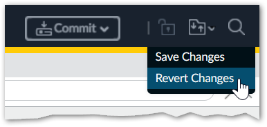

.. _troubleshooting:

Troubleshooting
===============

This section provides guidance for resolving common issues and adapting the project to your environment.

General Checks
--------------

If you encounter problems during installation or execution:

1. Ensure you are using Python **3.11**, **3.12**, or **3.13**.
2. Verify you have the required package versions:
   - `pan-python` **0.25.0**
   - `pan-os-python` **1.12.3**
3. Confirm that all required dependencies are installed.
4. Check your network connectivity to the target firewall(s) or Panorama.
5. Review error messages for specific details.
6. Consult the project's GitHub issues page for known problems and solutions.

Configuration and Permissions
-----------------------------

- Verify that zone names in ``settings.py`` match your actual firewall configuration.
- Ensure your PAN-OS device is reachable from your deployment environment.
- Check that your user account has sufficient privileges to make policy changes.
- Review logs:

  - ``logs/api_errors.log`` for error traces
  - ``logs/api_calls.log`` for API request details

Operational Notes
-----------------

- The script does **not** perform a commit automatically — you must commit changes manually.
- Ensure all prerequisites are met and external dependencies are in place:

  - NAT rules
  - User-ID subsystem provides all identities referenced in the policies and requirements
  - Forward Trust certificate is generated and deployed to the firewalls
  - The root CA of the Forward Trust certificate is trusted by all clients
  - EDL infrastructure is in place and reachable from the firewalls
  - Response Pages are customized
  - Service Desk workflows created and fully tested

- Review and adjust ``settings.py`` to customize behavior for your environment.

Error Recovery Workflow
-----------------------

If the script fails with an error message:

1. Review ``logs/api_errors.log``, ``logs/api_calls.log``, and the code to identify the issue.
2. Make the necessary changes to correct the error.
3. Revert all changes made by the deployment script on the target PAN-OS device
   (click the folder icon in the top-right corner of the web interface and select **Revert Changes**):

4. Remove any configuration and commit locks left behind by the script.

.. tip::

    Because of a bug in the current mainstream PAN-OS versions the locks may not
    be shown in the UI and yet the script would say that the lock is already taken.

    Use the PAN-OS CLI commands as follows to remove the locks:

    -  ``request commit-lock remove``
    -  ``request config-lock remove``

5. Rerun the deployment script.
